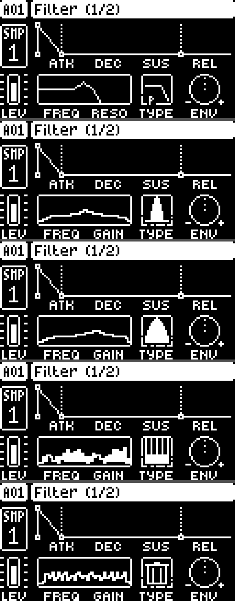
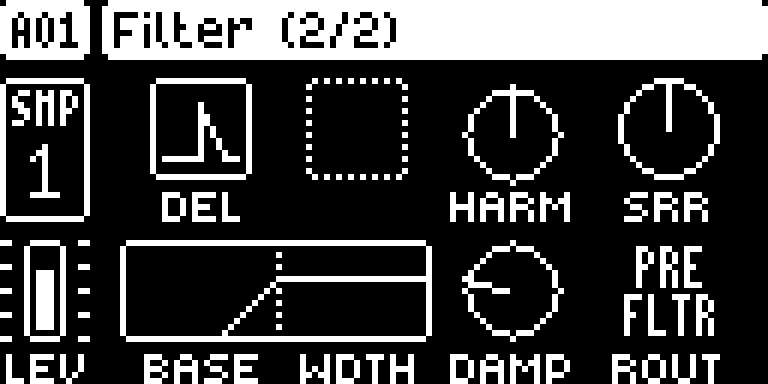

# DigiFilter

Extra per-track filter modes for the Elektron
Digitakt mk1 (OS 1.53).

A format-2 [elekloader](https://github.com/irpina/elekloader) mod, id
`digifilter`. It adds four filter types on top of the stock `OFF / LP / HP /
EQ:1..5`:

| TYPE | mode | what it is |
|---|---|---|
| 8 | **BP** | band pass (state-variable filter) |
| 9 | **BP2** | a wider band pass (about half the resonance) |
| 10 | **COMB** | feedback comb, delay from FREQ, feedback from RESO |
| 11 | **TRASH** | second comb at half the delay (a higher harmonic series) |

Each mode runs per track and uses that track's own FREQ, RESO and filter
envelope, exactly like the stock types. Stock TYPE values keep running the
stock filter — nothing here reimplements a stock mode.

The **FLTR page** redraws its FREQ/RES response curve for the new types (a
band-pass bell for BP/BP2, comb teeth for COMB, a trash can for TRASH) and shows
a small fixed version of each shape in the TYPE box to the right of the graph.
The screenshot shows the page for every type, top to bottom — LP (stock), BP,
BP2, COMB and TRASH:



> Digitakt **mk1 only**. Digitakt II's filter machines are out of scope.

## Status

The **audio path is done and validated** (BP / BP2 / COMB / TRASH), including
the **filter envelope**, the **comb's own controls** (feedback on the RESO/GAIN
knob, Harmonics/Damping on the free C/G encoders), and the **FLTR page's FREQ/RES
response curve and TYPE-box glyphs**, which now redraw for the new modes (a
band-pass bell for BP/BP2, comb teeth for COMB, a trash can for TRASH). The DSP
is **budgeted at or below the stock filter's cost** per voice per block. See
[RE_NOTES.md](RE_NOTES.md).

Everything in this repo builds (`BUILT`), lints against `core` and combines with
`digihealth` (`OK: the mods combine`).

## Known issues

- **BP (TYPE 8)** output is now **saturated to ±2^27** in the SVF (like the
  comb), so a high-Q peak on hot material clips cleanly instead of wrapping the
  32-bit sample. It is still a hard clip at the top of the range; back off
  RESO/ENV depth or use BP2 for very hot samples. (The resonance range is also
  capped at Q ~5.)

## Controls

- **FREQ (E)** sets the cutoff / comb pitch; **RESO / GAIN (F)** is the
  resonance, and for COMB/TRASH it is the comb **feedback** (0…127, up to 31/32
  for a metallic, near-self-oscillating ring); the
  **filter envelope (H + ADSR)** modulates the cutoff exactly as the stock types
  do.
- **Second FLTR page**, while TYPE is COMB or TRASH, adds **C = Harmonics**
  (delay divider 1–4) and **G = Damping** (a one-pole on the feedback), each
  shown as a round dial like the stock SRR knob. They sit **alongside** the
  stock **Base / Width / Env Delay / SRR** knobs, which keep working and saving
  normally — nothing is replaced. The two values are mirrored into saved kit
  words (best-effort persistence, since every sound slot is otherwise taken);
  their defaults (0) leave the plain comb.

  

## How it works

Three patch sites plus `ev_draw` / `ev_tick` subscriptions (addresses and the
full reverse-engineering are in [RE_NOTES.md](RE_NOTES.md)):

1. widen the Filter Type range field from max 7 to max 11;
2. re-point the TYPE label formatter so 8–11 print `BP / BP2 / COMB / TRASH`;
3. hook the per-voice filter call in the render and run our own DSP for TYPE
   8–11, tail-calling the stock filter for everything else;
4. subscribe to core's `ev_draw` (`digifilter_draw`, order 40): after the page
   has drawn, when the shown page kind is FLTR (6) and the active track's TYPE
   is 8–11, mask the stock graph and TYPE box and paint the BP/BP2/COMB/TRASH
   response curve plus the mode's small TYPE-box glyph.
   (This composes with the event chain; patching the page drawView vtable entry
   `0x401842a0` directly lost the curve in multi-mod builds.)
5. on each UI tick, when the active track's TYPE is COMB/TRASH, put the comb's
   extra controls on the second FLTR page's free C/G encoders: commandeer two
   unused `Error` descriptors as filter descriptors on spare sound slots
   (`0x2f/0x30`), labelled `HARM`/`DAMP`. The comb feedback is the RESO/GAIN
   knob on page 1 (0…127). The stock Base/Width/Env Delay/SRR knobs are left
   untouched; the stock layout and descriptors are restored for any other TYPE.
6. in the same `ev_draw` handler, on page kind 7 (second FLTR page) for
   COMB/TRASH, paint a round dial (circle + needle, like SRR's) in each of the
   two free C/G cells — the commandeered descriptors give the label and input
   but no value widget, since their slot is past the model's range.

Our DSP is integer-only (no FPU, no libgcc): a trapezoidal state-variable
filter for BP/BP2 and two feedback combs for COMB/TRASH. The cutoff and
resonance are smoothed (a coefficient ramp across the block, and a fractional,
smoothed comb delay) so modulating the filter does not step or click. The
filter envelope is added to the cutoff exactly as the stock filter does.

Per voice per render block (measured in digiemu), TYPE 1 (stock) costs ~2400
instructions; BP/BP2 ~2800; COMB/TRASH ~1750 — so the new modes are no more
expensive than the stock filter. The SVF computes its coefficients at the
block's two ends and ramps between them, and the comb's interpolation and
feedback each use a single 32×32 multiply.

## Building

Needs the m68k cross toolchain, an elekloader checkout, the stock
`Digitakt_OS1.53.syx`, and `core` (2.1). Set up the shell, then build:

```sh
export PATH="<m68k-elf bin>:$PATH"          # e.g. C:\SysGCC\m68k-elf\bin on Windows
export ELEKLOADER_CROSS=m68k-elf-
export PYTHONPATH="<elekloader checkout>"

python -m elekloader.sdk.build . --stock <Digitakt_OS1.53.syx>
python -m elekloader.lint  out/digifilter-1.0k.elemod --stock <Digitakt_OS1.53.syx> --with <core-2.1.elemod>
python -m elekloader.patch --stock <Digitakt_OS1.53.syx> --mod <core-2.1.elemod> --mod out/digifilter-1.0k.elemod --out custom.syx --version 2.0t --check
```

That must print `BUILT`, then `OK: links as core 2.1 …`, then `OK: the mods
combine`. Drop `--check` on the last command to write `custom.syx`.

`core` is elekloader's `mods/core` (built, or its release). Add
`--with <digihealth.elemod>` / `--mod <digihealth.elemod>` if you use it — the
third site is chosen so this mod does **not** overlap digihealth 1.0.

## Files

| file | contents |
|---|---|
| `mod.json` | the mod: id, version, sites, sources, `requires core` |
| `filter.c` | modes, coefficients, the comb DSP, the site entry point |
| `filter_dsp.s` | the per-voice state-variable filter (ColdFire EMAC) |
| `filter_glue.s` | the raw site entry points (labels + the per-voice dispatcher) |
| `filter_ui.c` | the `ev_draw` handler (`digifilter_draw`: response curve, TYPE glyph, page-2 dials) and the page-2 `ev_tick` re-map (`digifilter_page2_sync`) |
| `filter_tables.h` | `g`, `k`, frequency and comb-delay tables |
| `tests/filter_model.py` | floating-point reference (`svf_block`, `comb_gain`) |
| `tests/digiemu_filter_*.py` | headless digiemu traces/tests (need a digiemu checkout) |
| `tools/disas.py` | disassembly helper (`m68k-elf-objdump -m m68k:cfv4e`) |
| `tools/re_locate.py`, `tools/emu_filter.py` | early image/unicorn helpers |
| `RE_NOTES.md` | the reverse-engineering findings |

## Testing

```powershell
# floating-point model self-test (no toolchain needed)
python tests/filter_model.py

# live tests in digiemu (need a digiemu source checkout + a set-up firmware)
python tests/digiemu_filter_dsp.py  --digiemu <checkout> --fw <folder> --type 8
python tests/digiemu_filter_mod.py  --digiemu <checkout> --fw <folder> --type 10
python tests/digiemu_filter_cutoff.py --digiemu <checkout> --fw <folder>
python tests/digiemu_filter_curve.py --digiemu <checkout> --fw <folder>
python tests/digiemu_filter_page2.py --digiemu <checkout> --fw <folder>
```

## Licence

GPL-2.0-or-later. No Elektron firmware is included or committed.
